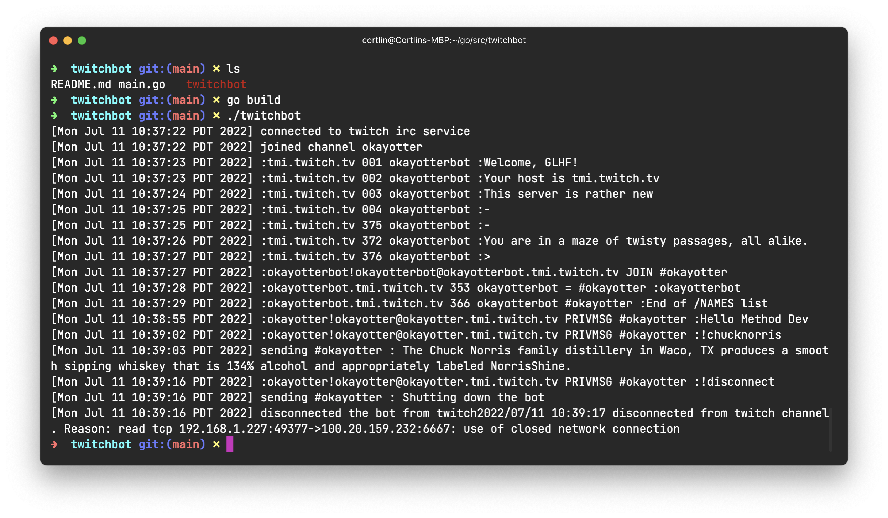
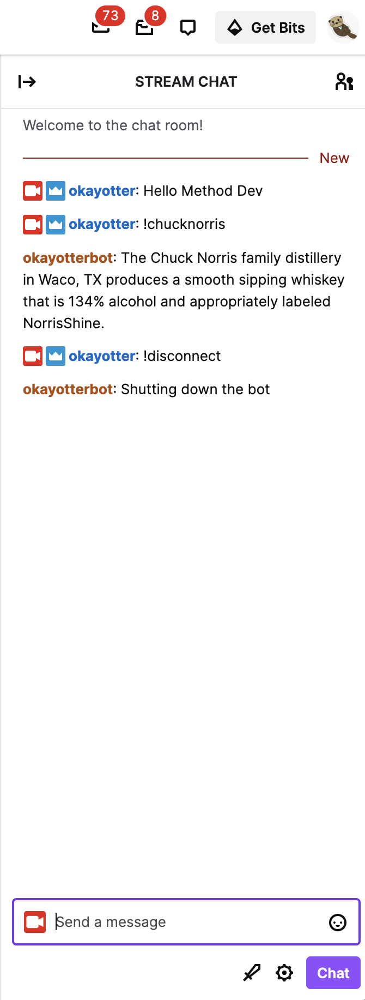

# twitchbot

Twitchbot assignment for Method.dev using GoLang

# Method Dev Assignment - Twitch Bot

## Screenshot of app

**Terminal**

**Twitch Chat**

## Overview

---

Create an automated [Twitch](https://dev.twitch.tv/docs/irc) chat bot console application that can be run from a command line interface (CLI).

## Requirements

---

The bot application should be able to:

- Console output all interactions - legibly formatted, with timestamps.
- Connect to Twitch IRC over SSL.
- Avoid premature disconnections by handling Twitch courier ping / pong requests.
- Join a channel.
- Read a channel.
- Write to a channel - reply to a user-issued string command within a channel (e.g. !YOUR_COMMAND_NAME).
  - CORTLIN SPECIFICALLY: Reply to the "!chucknorris" command by dynamically returning a random fact about Chuck Norris using the [Chuck Norris API](https://api.chucknorris.io).

## Caveats

---

- Perferrably, the application should be written in Go lang, using the [standard library](https://golang.org/pkg/).
  - If time is a limiting factor, using a platform of your choice is permitted upon request.
- The application must be written without third-party module dependencies.
- All interactions should be asynchronous.
- The application should account for Twitch API rate limits.
- The application should not exit prematurely.
